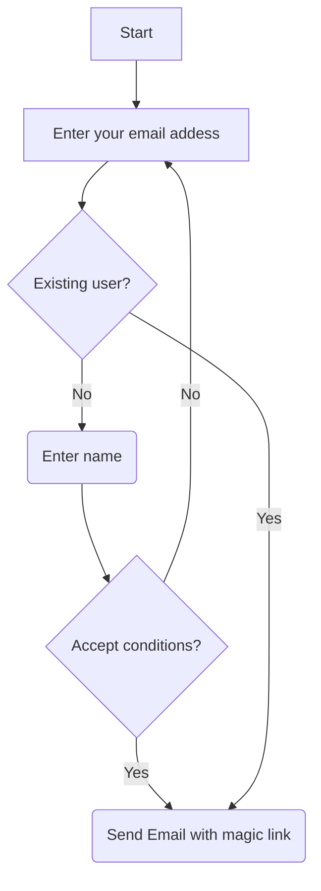

```mermaid
flowchart TB
    S[Start] --> A;
    A[Enter your email addess] --> B{Existing user?};
    B --> |No| C(Enter name);
    C --> D{Accept conditions?};
    D --> |No| A
    D --> |Yes| E(Send Email with magic link);
    B --> |Yes| E;
```