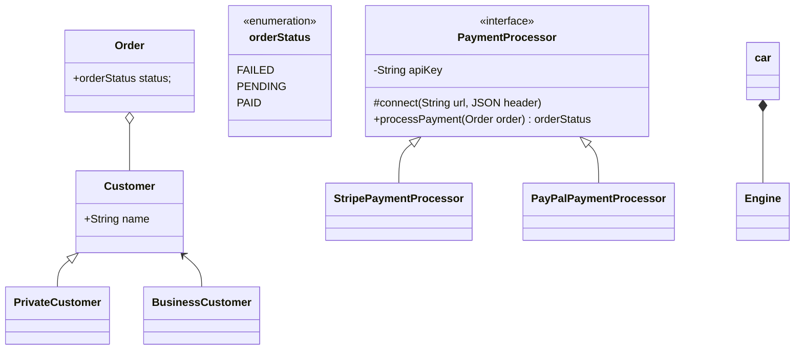

#MERMAID tutorial

```mermaid
classDiagram
    class Order{
        +orderStatus status;
    }
    class orderStatus{
        <<enumeration>>
        FAILED
        PENDING
        PAID
    }
    class PaymentProcessor{
        <<interface>>
        -String apiKey
        #connect(String url, JSON header)
        +processPayment(Order order) orderStatus
    }
    class Customer{
        +String name
    }
    Customer <|-- PrivateCustomer
    Customer <-- BusinessCustomer
    PaymentProcessor <|-- StripePaymentProcessor
    PaymentProcessor <|-- PayPalPaymentProcessor
    Order o-- Customer
    car *-- Engine

```