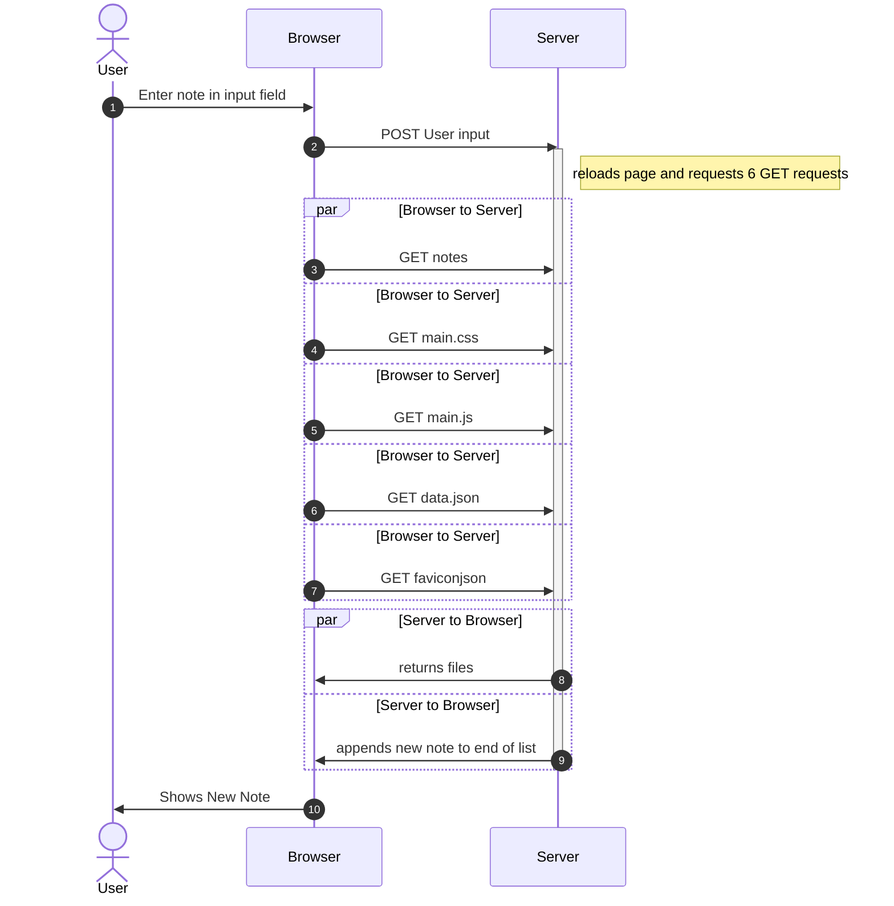

```mermaid
sequenceDiagram
    autonumber
    actor User
    participant Browser
    participant Server

    User->>Browser: Enter note in input field
    Browser->>Server: POST User input
    activate Server
    Note right of Server: reloads page and requests 6 GET requests
    par Browser to Server
        Browser->>Server: GET notes
    and Browser to Server
        Browser->>Server: GET main.css
    and Browser to Server
        Browser->>Server: GET main.js
    and Browser to Server
        Browser->>Server: GET data.json
    and Browser to Server
        Browser->>Server: GET faviconjson
    end

    par Server to Browser
        Server->>Browser: returns files
    and Server to Browser
        Server->>Browser: appends new note to end of list
    end
    deactivate Server

    Browser->>User: Shows New Note
```