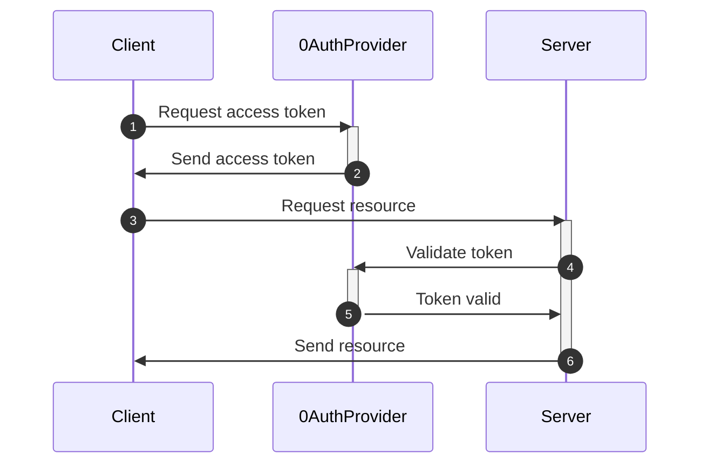

```mermaid
sequenceDiagram
    autonumber
    participant Client
    participant 0AuthProvider
    participant Server
    Client->>0AuthProvider: Request access token;
    activate 0AuthProvider;
    0AuthProvider->>Client: Send access token;
    deactivate 0AuthProvider
    Client->>Server: Request resource;
    activate Server;
    Server->>0AuthProvider: Validate token;
    activate 0AuthProvider;
    0AuthProvider->>Server: Token valid;
    deactivate 0AuthProvider;
    Server->>Client: Send resource;
    deactivate Server;

```